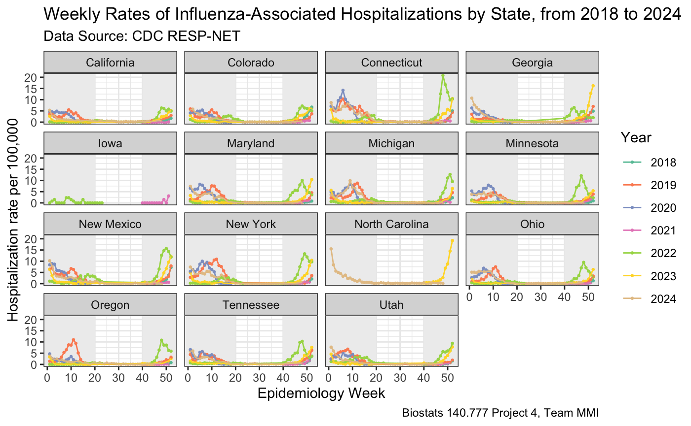

<div style="text-align: center;">
{width=50%}
</div>

## Project

This dashboard aims to investigate the relationship between climate and weather-related conditions and outbreaks of two respiratory viruses, **influenza** and **respiratory syncytial virus (RSV)**.

Influenza is an RNA virus from the *Orthomyxoviridae* family that frequently mutates, causing seasonal epidemics, while RSV is an RNA virus from the *Paramyxoviridae* family that primarily affects young children and the elderly, often leading to severe lower respiratory infections. Both viruses pose significant public health challenges due to their widespread transmission and potential for severe disease.

Climate and weather conditions can influence the activity and spread of both viruses. Studies have suggested that factors like **cold temperatures**, **low indoor humidity**, **limited sunlight**, and **rapid weather changes** may increase the risk of disease outbreaks.

## Features
### Weekly Rates

This dashboard uses [CDC RESP-NET data](## Respiratory Virus Related Hospitalization Rate) to give an overview of influenza and rsv hospitalization rates of each state from 2018 to 2024. The user can select year, state, and pathogen of interest using the interactive filters. 

### Weather Explorer

This dashboard integrates [environmental parameter data](### Environmental Parameters) from openmeteo API and respiratory virus-associated hospitalization rate data to perform regression analysis. The user can select year, state, weather variable and pathogen of interest using the interactive filters. 

## Data

### Respiratory Virus Related Hospitalization Rate

Disease rate data were scrapped from  [CDC RESP-NET](https://data.cdc.gov/Public-Health-Surveillance/Rates-of-Laboratory-Confirmed-RSV-COVID-19-and-Flu/kvib-3txy/about_data). Note that both viruses' seasonalities have changed significantly during and after the COVID-19 pandemic. 

#### Summary of Influenza Data

<div style="text-align: center;">
{width=100%}
</div>

#### Summary of RSV Data

<div style="text-align: center;">
{width=100%}
</div>

### Environmental Parameters

Weather data were scrapped from [Openmeteo API](https://open-meteo.com/).

#### Correlation Heatmap

From the figure below, we can see that respiratory virus associated hospitalization rate (`weekly_rate`) has the highest correlation with maximum and minimum daily temperature, sunshine, daylight, shortwave radiation, and evaporation. 

<div style="text-align: center;">
{width=50%}
</div>

### Data Dictionary

Here is an overview of the combined dataset of weekly environmental parameters and respiratory virus-related hospitalization rates used for data analysis and dashboard building.

```{r, echo = FALSE}
library(knitr)

datadic <- data.frame(
  Variable = c("site", "weekly_rate", "cumulative_rate", "date", "year", "week", "y_w", "pathogen",
               "temp_max", "temp_min", "precip_sum", "precip_hr", "sunshine", "daylight", 
               "wind_speed_max", "wind_gusts_max", "wind_direction", "shortwave", "evapo"),
  Description = c("U.S. state participated in RESP-Net",
                  "weekly respiratory virus-related hospitalization rate",
                  "cumulative respiratory virus-related hospitalization rate",
                  "date at end of the corresponding epidemiological week",
                  "year",
                  "epidemiological week",
                  "year and epidemiological week combined",
                  "respiratory virus type",
                  "maximum daily temperature (weekly average)",
                  "minimum daily temperature (weekly average)",
                  "sum of precipitation - rain and snow (weekly average)",
                  "duration of precipitation - rain and snow (weekly average)",
                  "duration of sunshine (weekly average)",
                  "duration of daylight (weekly average)",
                  "maximum windspeed (weekly average)",
                  "maximum gusts (weekly average)",
                  "dominant wind direction (weekly average)",
                  "sum of solar radiation (weekly average)",
                  "sum of ET0 Reference Evapotranspiration of a well watered grass field (weekly average)"),
  Unit = c("/", "per 100,000", "per 100,000", "/", "/", "/", "/", "/", "°C", "°C", "mm", "hours", 
           "seconds", "seconds", "km/h", "km/h", "°", "MJ/m²", "mm")
)

kable(datadic)
```

## Contact Us

**Team MMI** are **Yunyi Ru** (yru3@jh.edu) and **Juanyu Zhang** (jzhan398@jh.edu). 

For source code, please see our [github repository](https://github.com/jhu-statprogramming-fall-2024/project4-team-mmi).

- Last maintained: 2024-12-19

- CDC data update: 2024-11-30

*This dashboard is made by [r shinydashboard](https://rstudio.github.io/shinydashboard/) for a class project of Johns Hopkins University Biostatistics 140.777 [Statistical Programming Paradigms](https://www.stephaniehicks.com/jhustatprogramming2024/)*.
